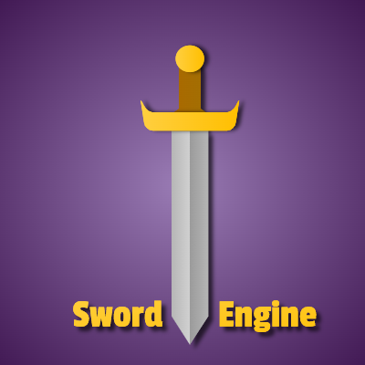

[Click here for English](readme.md)
# Sword Engine 
## The Simplest Game Engine

***

### नमस्कार दोस्तों!
मुझे यह देखकर बहुत खुशी हुई कि आप इस परियोजना में रुचि रखते हैं और इसे पढ़ रहे हैं।
मैं वास्तव में इस परियोजना को शुरू करने से डरता था क्योंकि मुझे यकीन नहीं था कि क्या मैं इसे काम कर सकता हूं।

लेकिन आज हम यहाँ हैं!

मैंने इसे काम कर दिया .. और यह बस काम कर रहा है .. तुम्हें पता है?
क्योंकि मैंने इस परियोजना को एक सप्ताह में पूरा कर लिया है, निश्चित रूप से कुछ समस्याए हैं, लेकिन मुझे यकीन नहीं है कि वे सभी ठीक हो गए हैं। और उनमें से सबसे बड़ी बात यह है कि आप उत्पादन(producation) का निर्माण(build) नहीं कर सकते, आप केवल विकास (development) में काम कर सकते हैं।

``` pnpm dev या npm run dev ``` . का उपयोग करना
यह इंजन की समस्या नहीं है, बल्कि मेरे द्वारा उपयोग किए जाने वाले  निर्माण तंत्र (build tool)  की समस्या है। (ViteJS)


मैं इस पर भविष्य में काम करने की कोशिश करूंगा। लेकिन अभी के लिए, मैं सिर्फ इतना कहूंगा कि यह काम कर रहा है।

**आप मेरे द्वारा tsdocs का उपयोग करके बनाए गए मूल दस्तावेज़ों को देखने के लिए नीचे दिए गए लिंक पर क्लिक कर सकते हैं, और यह कम से कम पढ़ने के लिए पर्याप्त अच्छा लगता है**

[मूल दस्तावेज के लिए यहां क्लिक करें](https://himanshurajora.github.io/sword-engine/)

ठीक है आगे बढ़ रहा हूँ..

इस परियोजना में मूल रूप से उपयोगिताएँ हैं जो आपको अपना गेम या कम से कम मिनीगेम तो बनाने में मदद करेंगी ही।
यह गेम फ्रेम को ड्रा करने के लिए html canvas का उपयोग करता है।
सीपीयू के केवल एक thread का उपयोग करता है क्योंकि JavaScript डिफ़ॉल्ट रूप से सिंगल थ्रेडेड प्रोग्रामिंग भाषा है।

इसमें वर्ग शामिल हैं जैसे:
वेक्टर, पार्टिकल, शेप, रेक्टेंगल (टकराव के लिए), गेमऑब्जेक्ट (केवल एब्सट्रैक्ट क्लास), बेज़ियर कर्व्स आदि, यही कुछ अन्य वर्ग भी हैं जो आपको अपना गेम और यूटिलिटी ऑब्जेक्ट बनाने में मदद करेंगे, जिसे यूटिल्स कहा जाता है।

मैंने नमूने फ़ोल्डर में कुछ कामकाजी उदाहरण रखे हैं।
उसमें सम्मिलित है :
- सिमुलेशन
    - सौर प्रणाली
    - बारिश हो रही है
    - बेज़ियर कर्व
- खेल
    - साँप
    - अंतरिक्ष युद्ध
    - फ्लैपी चिड़ियां
- डीएसए सिमुलेशन
    - 0-1 बस्ता समस्या

ठीक है आगे बढ़ रहा हूँ..

सभी कोड ओपन सोर्स हैं और आप इसे जीथब पर पा सकते हैं कि आप शायद इसे पढ़ रहे हैं।

src फोल्डर में इंजन का सोर्स कोड होता है।
आपको एक यूटिल्स फ़ोल्डर दिखाई देगा जिसमें सभी उपयोगिता वर्ग शामिल हैं।

आप इसे लागू करने के लिए किसी भी बिल्ड टूल का उपयोग कर सकते हैं।

**लेकिन**
**मैं चाहता हूं कि आप मेरे गेम इंजन का उपयोग न करें, क्योंकि मैं चाहता हूं कि आप अपना खुद का गेम इंजन बनाएं।**

**आप समझ गए!**

यह मैं आपको बाद में बताऊंगा कि आप अपना खुद का गेम इंजन कैसे बना सकते हैं?
ठीक है.. इस रीडमी के लिए बस इतना ही।
फिर मिलेंगे।

### वैदिक देव द्वारा निर्मित - हिमांशु जांगिड़
पढ़ने के लिए शुक्रिया!
वीसीएफ आपसे सदैव प्रेम करता है!